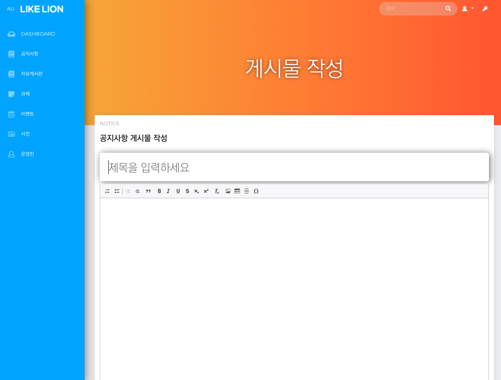
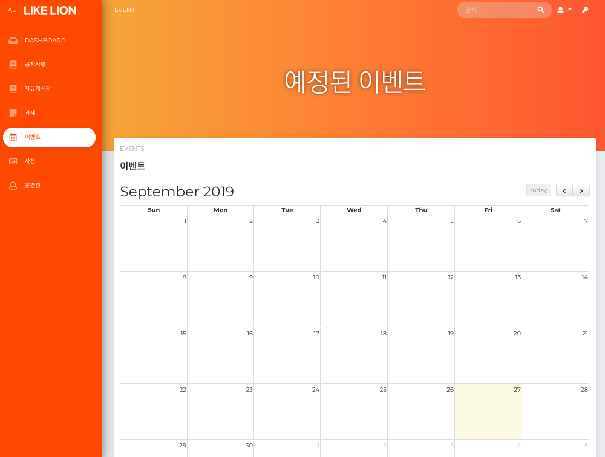
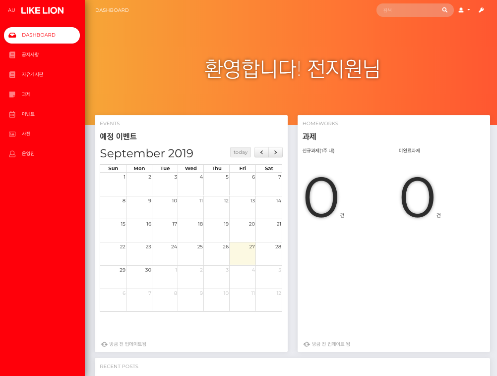
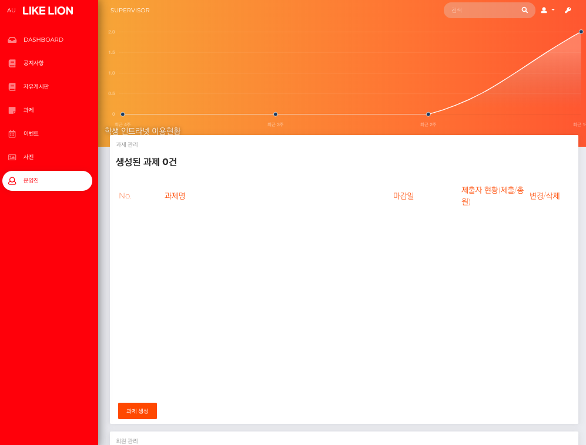
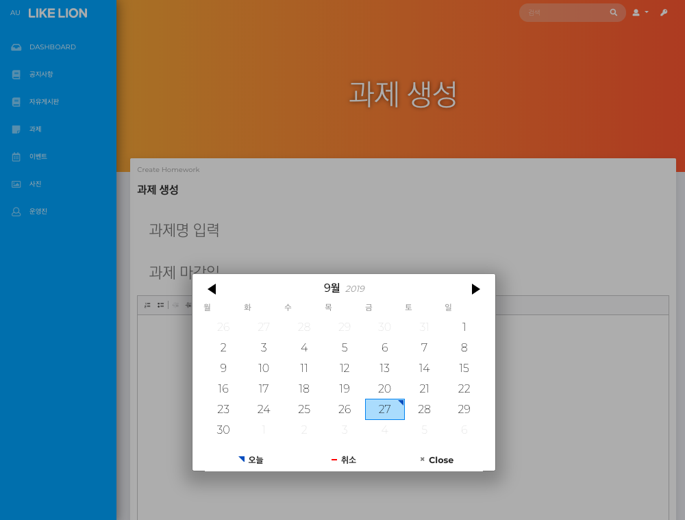

<p align="center"></p>


# 아주대학교 멋쟁이사자처럼 인트라넷 (6기)

아주대학교 멋쟁이사자처럼 그룹에서 공동 정보공유, 과제처리, 회원관리, 이벤트 설정, 사진 관리 등 전반적인 활동 기록 및 보관을 위해 사용하는 웹서비스입니다.








---

!! EC2에 올린 이후 인스턴스 상에 ImageMagick 바이너리 설치가 되어있어야 합니다!
```
sudo apt-get install ImageMagick
```

!! 바이너리 디렉터리 설정 (/config/environments/production.rb)
```
Paperclip.options[:image_magick_path] = "/opt/ImageMagick/bin"
Paperclip.options[:command_path] = "/opt/ImageMagick/bin"
```

!! Rails Version `5.0.6` | Ruby Version `2.3.4p0`

!! 운영진 권한 : User 테이블 `level 필드 값 2`로 설정

---

Copyright 2018 AUlikeLion 6th, Coded by J.W.Jeon, 4th Member of AUlikeLion.